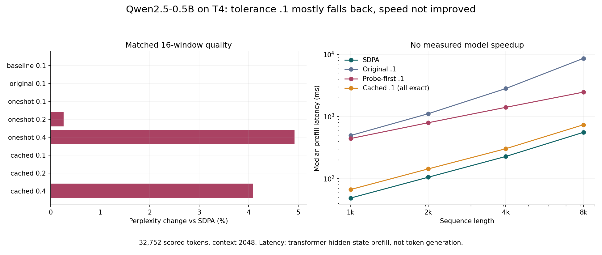
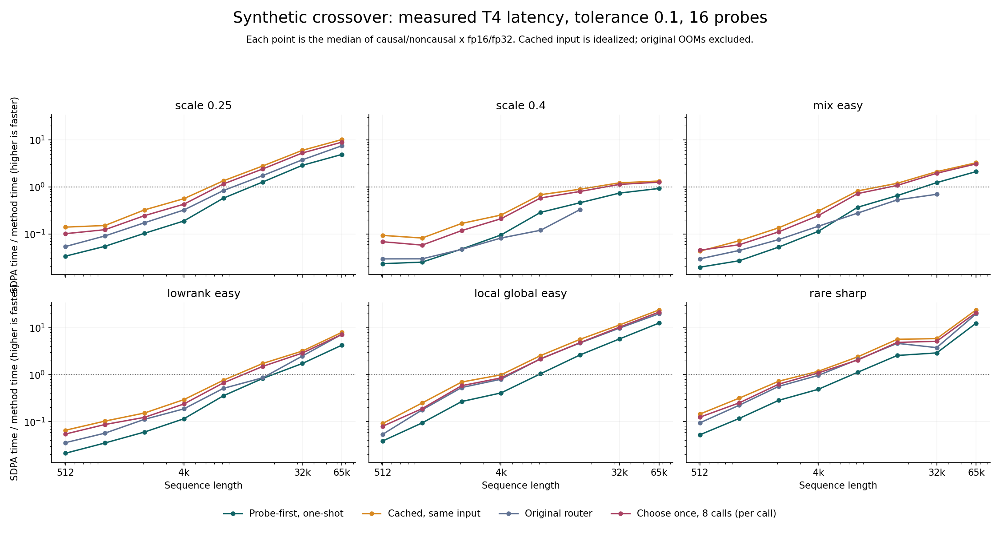
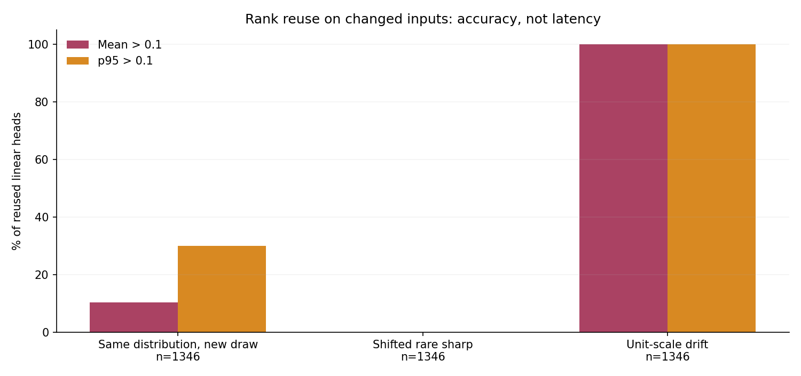

# Adaptive-rank router: detailed measured evaluation

2026-10-05. Tesla T4, torch 2.11.0+cu128. Starting repository commit: `68960ab`.

## Verdict

The router is not a useful Qwen2.5-0.5B acceleration path in the measured 1k-8k prefill range. At tolerance 0.1 it mostly falls back to exact attention, keeps perplexity close to baseline, and is slower. Relaxing the tolerance accepts more linear heads but worsens perplexity without producing a model speedup.

Synthetic long-context wins exist, but are conditional. A mean-probe gate does not guarantee held-out mean, tail, or worst-query accuracy. Cached ranks are unsafe under the tested unit-scale drift. This corrects the earlier broad description of the router as "correct": execution can be finite and the probe criterion can pass while unprobed queries exceed tolerance.

## Real Qwen results

Actual post-RoPE Q/K/V captures from layers 0, 6, 12, 18 and 23, four windows. Quality uses the same 16 held-out WikiText-2 test windows, context 2048, after two calibration windows: 32,752 tokens scored. All windows were finite.

| Method | Tolerance | Perplexity | Change vs baseline |
|---|---:|---:|---:|
| SDPA baseline | n/a | 13.14547 | 0% |
| Original router | .1 | 13.14624 | +0.0058% |
| Probe-first one-shot | .1 | 13.14691 | +0.0109% |
| Probe-first one-shot | .2 | 13.18026 | +0.2647% |
| Probe-first one-shot | .4 | 13.79296 | +4.9255% |
| Cached hybrid | .1 | 13.14547 | 0% |
| Cached hybrid | .2 | 13.14669 | +0.0093% |
| Cached hybrid | .4 | 13.68198 | +4.0813% |

At .1, the captured activation sweep with 16 probes accepted no linear heads (0/280). Across the four timing inputs, original/one-shot accepted only 8/1,344 layer/head choices (0.60%). Cached .1 used **zero linear heads**. Its unchanged perplexity is an all-exact result, not proof that linear reuse is safe. Cached .4 used 64/1,344 linear choices (4.76%). Timing choices are not a count over the 16 quality windows.

| N | SDPA | Original .1 | Probe-first .1 | Cached .1 |
|---:|---:|---:|---:|---:|
| 1024 | 48.7 ms | 493.8 ms | 441.5 ms | 66.8 ms |
| 2048 | 105.3 ms | 1106.0 ms | 792.3 ms | 143.4 ms |
| 4096 | 227.3 ms | 2810.8 ms | 1401.1 ms | 302.9 ms |
| 8192 | 555.0 ms | 8587.9 ms | 2460.6 ms | 735.0 ms |

These are measured transformer hidden-state prefill times, excluding the output projection/head. They are not decode/token-generation times. Every measured router/cache variant was slower than baseline at every tested length. Quality was tested at 2048 only; longer quality or a model crossover beyond 8192 is unmeasured.



## Synthetic coverage and accuracy

18 regimes: Gaussian scales .1/.2/.25/.3/.4/.5/.75/1, easy/broad head mixes, low-rank, clusters, smooth local/global patterns, and rare-sharp/shifted rare-sharp rows. Causal and noncausal, fp16/fp32, three sensitivity seeds. Nine tolerances (.01 through .4), six probe counts (4 through 128). Random features use ranks 64/256/1024. The scale grid has six prespecified regimes, eight lengths 512 through 65,536, one timing seed.

Measured records: 93,312 sensitivity head decisions; 5,184 rank-error curves; 2,112 timings; 6,912 scaling/head/cache audit rows. The latter includes different row types, not 6,912 independent timing trials. Audit uses 256 disjoint query rows. Full-query audits exist only for scaling N<=4096.

At .1 / 16 probes, 1,006/1,728 sensitivity cases selected a linear rank. Of those accepted cases:
- 28/1,006 (2.8%) exceeded .1 mean relative L2 error on held-out audit rows.
- 350/1,006 (34.8%) exceeded .1 p95 error. The router gates mean error, not p95.

More probes reduce mean false acceptance but do not enforce a tail criterion. Full-query audits found 38/684 selected-linear head cases with mean error above .1. Some p95 values exceed .1 too. Rare-sharp specifically has mean and p95 below .1, but worst-query relative error up to 1.015. A relative L2 error of 1.015 is not a statement that the output is "2x wrong."


## Synthetic speed and memory

Aggregate median speedups below are medians across the six regimes x causal/noncausal x fp16/fp32. They do not say every case loses or wins at that length. Speedup is SDPA time / method time; >1 is faster. Original-router medians exclude failed rows, making long-length survivor medians optimistic.

| N | Probe-first one-shot | Cached same input | Original router | Choose once, 8 calls per-call |
|---:|---:|---:|---:|---:|
| 512 | .026x | .082x | .038x | .068x |
| 1024 | .037x | .128x | .083x | .101x |
| 2048 | .076x | .237x | .141x | .186x |
| 4096 | .147x | .380x | .238x | .316x |
| 8192 | .486x | .985x | .510x | .879x |
| 16384 | .921x | 1.731x | 1.347x | 1.500x |
| 32768 | 1.725x | 3.169x | 2.934x | 2.876x |
| 65536 | 3.558x | 6.584x | 12.663x | 5.975x |

Probe-first wins 62/192 measured cases; cached same-input wins 84/192; original wins 59/178 successful cases and OOMs in 14/192. All 14 OOMs are original-router scale .4 or mixed-head cases, starting at N16384 for causal scale .4. No other timing method OOMed in this grid. All returned attention outputs were finite. The selection-only finite flag refers to its rank tensor, not an attention output. Raw CUDA-event times, wall times, repetitions and measured peak memory are in the CSV.

The original implementation computes full candidate outputs and uses a dense exact fallback. Probe-first samples candidates and uses SDPA fallback. They are separate implementations, not interchangeable names. The repeated-call tests actually execute 2/4/8 calls with selection paid once; their raw CSV time is the total and the chart divides it by call count. Same-input cached timing is idealized, not deployment evidence.



## Cache drift

Across 1,346 reused-linear head cases for each drift group, every unit-scale drift case exceeded .1 mean and p95 error. Same-distribution new draws also sometimes failed, particularly near the selection boundary. Shifted rare-sharp cases passed these sampled mean/p95 tests, but the all-query rare-sharp finding shows why that is not a safety guarantee. No same-input speed result repairs this accuracy issue.



## Execution history and reproducibility

The full first run completed sensitivity and scaling, then failed at the first Qwen capture because our wrapper unpacked `_expand_kv` into three outputs instead of two. This was a harness bug, not a model result. Fixed that one line, added a regression test, and resumed only Qwen with the same model/windows/tolerances. No synthetic regime or criterion was changed after seeing results. Original synthetic source is preserved in `results/router_detailed/source_v1/`; hashes match its manifest. Qwen source hashes match the current runner.

Version 1 manifest deliberately retains `finished_utc: null` and records `completed_parts: [sensitivity, scaling]`. The Qwen-only manifest records completion. Its live log confirms Tesla T4 and 22 tests passed. Four local router math/contract tests pass too. Visible log excerpts may omit rows below the site's lazy-loaded view; CSVs and manifests are the complete result artifacts used here.

Run:
```
python run_router_detailed.py --parts sensitivity scaling qwen
python make_router_detailed_report.py
```
The runner refuses CPU and non-T4 hardware. Both saved runs used torch 2.11.0+cu128, CUDA 12.8 and transformers 5.16.1. This is a different environment from the earlier Colab measurements; do not pool timings across those runs.

Raw data: `results/router_detailed/` and `results/router_detailed_qwen/`. Qwen metadata records model revision, corpus token hash, offsets and context. The follow-up changes are documented in `results/router_detailed/post_result_changes.md`.

## What this does not establish

One model, one corpus, 16 quality windows, selected capture layers, one T4 and one feature seed do not establish universal behavior. Sparse sharp-query sampling can miss rare failures. Full-query accuracy beyond 4096 is unmeasured. Longer Qwen quality, decode performance, distribution-aware cache invalidation, and a stricter tail/max-error gate remain open work, not claims made by this evaluation.
